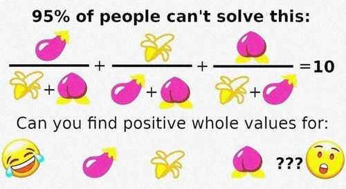

#  History
tags: math

## Description

>This showed up in my fuzeb00k feed.

Check against:
*nc math.uni.hctf.fun 4321* 
(Please don't DOS D:)

The task ask to find positive values for: a, b, c such that `a/(b+c) + b/(a+c) + c/(b+a) = N` with N = 10.

## Solution

The solution is very difficult, it involves elliptic curves and number theory as explained in [this Quora answer](https://www.quora.com/How-do-you-find-the-positive-integer-solutions-to-frac-x-y+z-+-frac-y-z+x-+-frac-z-x+y-4/answer/Alon-Amit). It also shows a result for N = 4, but we need N = 10.
Luckily duckduckgo is our friend and provides us with [this stackexchange post](https://math.stackexchange.com/questions/402537/find-integer-in-the-form-fracabc-fracbca-fraccab/409450#409450) that contains also an answer for N = 10.

The enormous values for a, b, c are:

`a=221855981602380704196804518854316541759883857932028285581812549404634844243737502744011549757448453135493556098964216532950604590733853450272184987603430882682754171300742698179931849310347`

`b=269103113846520710198086599018316928810831097261381335767926880507079911347095440987749703663156874995907158014866846058485318408629957749519665987782327830143454337518378955846463785600977`

`c=4862378745380642626737318101484977637219057323564658907686653339599714454790559130946320953938197181210525554039710122136086190642013402927952831079021210585653078786813279351784906397934209`

Sending them via netcat gives us the flag: `flag{c0ngr4ts_f0r_s0lv1ng_a_f4ceb00k_riddle}`
